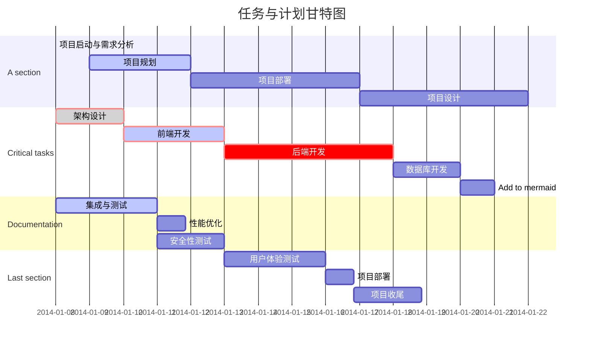

# 项目名称：汪汪在线小游戏

## 状态与版本信息：

### 文件状态：开发中

### 当前版本：最新版本

### 作者：

班级：软工2102、软工2103

姓名：马彤、刘瑞翔、李晓东、孟令一、马云龙、陈科瑞、田羽、戴家兴、王志成、张奕彤、倪芊睿、刘翼翔

团队名称：汪汪队

### 完成日期：第六周

## 引言：

### 编写目的：

课程需要

### 背景：

打造一个在线小游戏网站，用户可以通过平台访问和玩多种类型的小游戏。管理员可以在网站后台方便地添加、修改、管理新的小游戏，不断扩展游戏库。

## 项目概述

### 工作内容：

本项目旨在开发一个集多种小游戏于一体的在线游戏平台，即“汪汪在线小游戏”。具体工作内容包括：

1. 前端开发

    - 设计并实现用户友好的游戏平台界面，支持游戏展示、用户登录/注册、游戏选择及进入游戏等功能。
    - 集成Vue.js框架，实现响应式布局和组件化开发，提高界面交互性和用户体验。

2. 后端开发

    - 搭建并配置Python后端服务器，使用Flask或Django框架处理业务逻辑和数据交互。
    - 设计并实现用户管理、游戏管理、游戏进度存储等核心功能。
    - 提供RESTful API接口，供前端调用，实现前后端分离。

3. 数据库设计与实现

    - 设计合理的数据库结构，存储用户信息、游戏信息、游戏进度等数据。
    - 实现数据的增删改查操作，确保数据的一致性和完整性。

4. 小游戏开发与集成

    - 每位团队成员负责开发一款简易小游戏，并确保游戏逻辑正确、界面美观。
    - 将小游戏集成到主平台中，实现游戏的选择和启动功能。

5. 测试与调优

    - 对平台进行功能测试、性能测试和安全测试，确保平台稳定可靠。
    - 根据测试结果进行必要的调整和优化，提高平台的用户体验。

   ### 主要参加人员：

姓名：马彤、刘瑞翔、李晓东、孟令一、马云龙、陈科瑞、田羽、戴家兴、王志成、张奕彤、倪芊睿、刘翼翔

### 产品：

### ①程序：

- 前端程序：基于Vue.js框架开发的用户界面程序，包括HTML、CSS、JavaScript等文件。
- 后端程序：基于Python的Flask或Django框架开发的服务器端程序，包括API接口、业务逻辑处理和数据交互等。

### ②文件

- 设计文档：包括需求分析文档、设计文档、测试文档等。
- 源代码：前端和后端程序的源代码，包括所有模块和组件的代码文件。
- 数据库脚本：用于创建数据库表和初始化数据的SQL脚本。

### ③服务：

- 提供7x24小时的技术支持服务，确保平台稳定运行。
- 定期对平台进行维护和升级，以提高平台的性能和安全性。

### ④非移交产品：

- 项目开发过程中使用的开发工具、测试环境等不属于移交范围。
- 团队成员在项目开发过程中积累的技术经验和知识也不属于移交范围。

### 验收标准：

1. **功能完整性**：平台应实现所有设计的功能，包括用户登录/注册、游戏展示、游戏选择及进入游戏等。

2. **界面美观性**：平台界面应简洁美观，符合用户审美需求。

3. **数据一致性**：数据库中的数据应保持一致性和完整性，无数据丢失或错误。

4. **性能稳定性**：平台应具备良好的性能，能够处理大量用户同时在线和游戏的情况。

5. **安全性**：平台应具备一定的安全性，能够防止用户数据泄露和恶意攻击。

   ### 完成项目的最迟期限：

   本项目最迟应在开学第八周前完成，以确保项目能够按时上线并投入运营。

## 角色定义及分配

### 1. **项目经理（Project Manager）**

- 角色职责

    - 负责整体项目的规划、监督、协调和管理，确保项目按计划推进。
    - 处理团队之间的沟通，确保任务按时完成并符合项目目标。
    - 制定项目时间表、预算，并跟踪项目进度。
    - 风险管理，及时处理项目中的问题和挑战。

- **分配人选**：刘瑞翔

### 2. **产品经理（Product Manager）**

- 角色职责

    - 负责定义产品的功能需求和用户体验设计。
    - 与客户及利益相关者沟通，收集需求并转化为产品特性。
    - 制定产品路线图，定义优先级和里程碑。
    - 评估用户反馈并制定产品改进计划。

- **分配人选**：戴家兴

### 3. **前端开发工程师（Frontend Developer）**

- 角色职责

    - 使用 Vue.js 负责项目前端界面的开发和优化，确保平台的响应速度和用户体验。
    - 实现用户界面的设计原型，确保跨浏览器的兼容性和适配性。
    - 负责与后端开发的接口对接，确保前后端数据的同步。
    - 参与前端代码的测试、维护和优化。

- **分配人选**：李晓东，马彤。

### 4. **后端开发工程师（Backend Developer）**

- 角色职责

    - 使用 Python 及 Flask 或 Django 负责后台逻辑、API接口和业务数据处理。
    - 设计并实现高效的数据库结构（PostgreSQL/MySQL），确保系统数据的完整性和可扩展性。
    - 实现游戏管理功能模块，包括游戏上传、管理、更新等功能。
    - 负责系统的安全性和性能优化，确保能够应对高并发访问。

- **分配人选**：王志成，刘翼翔

### 5. **数据库管理员（Database Administrator）**

- 角色职责

    - 设计并管理 PostgreSQL 或 MySQL 数据库，确保数据的存储、备份和恢复。
    - 优化数据库性能，确保查询效率和数据安全。
    - 监控数据库的健康状态，处理数据库相关的性能瓶颈。
    - 处理数据库的迁移、扩展需求。

- **分配人选**：陈科瑞，孟令一

### 6. **测试工程师（QA Engineer）**

- 角色职责

    - 制定测试计划，设计测试用例，确保每个功能模块符合要求。
    - 进行功能测试、性能测试、压力测试和安全性测试，确保系统的稳定性和安全性。
    - 负责前后端接口的测试，确保数据传递准确无误。
    - 发现并跟踪项目中的缺陷（bugs），与开发人员协调解决问题。

- **分配人选**：田羽

### 7. **UI/UX 设计师（UI/UX Designer）**

- 角色职责

    - 设计网站和游戏的用户界面，确保页面美观、简洁并符合用户习惯。
    - 设计交互流程，优化用户体验，确保平台的易用性。
    - 提供设计原型并与前端开发工程师密切合作，确保设计方案能够高质量实现。
    - 不断优化和改进现有界面的用户体验，基于用户反馈进行调整。

- **分配人选**：倪芊睿，张艺彤

### **过程域方法与工具**

### 1. **项目启动阶段**

- **目标**：明确项目的目标、范围、需求，并确保项目有明确的指导和方向。
- **方法与工具**：
    - **需求分析方法**：
        - **访谈法**：与客户和利益相关者交流，收集对小游戏平台的需求和期望。
        - **头脑风暴法**：通过团队内部的集思广益，明确系统的功能需求和可能的挑战。
    - **需求管理工具**：
        - **Jira**：用于管理需求、任务和团队成员的职责分配，便于后续需求跟踪和变更。
        - **Trello**：简化的项目看板工具，适合较小团队用于任务和需求管理。
    - **项目计划工具**：
        - **Microsoft Project**：用于制定项目甘特图，规划时间表和里程碑，监控项目进度。
        - **WBS (工作分解结构)**：细分项目任务，明确每个任务的负责人和时间节点。

### 2. **需求定义和设计阶段**

- **目标**：明确用户需求，制定系统架构和设计文档，规划前后端功能。
- **方法与工具**：
    - **需求收集与优先级排序**：
        - **MoSCoW分析法**：通过 Must-have、Should-have、Could-have、Won't-have 的分类，帮助团队明确功能优先级。
        - **用例图 (Use Case Diagrams)**：通过绘制用例图帮助开发团队理解各个角色与系统的交互。
    - **原型设计工具**：
        - **Figma**：设计用户界面和交互，帮助开发人员了解前端的布局和设计。
        - **Sketch**：快速绘制系统原型，获取利益相关者的反馈。
    - **数据库设计工具**：
        - **MySQL Workbench**：用于设计并优化数据库结构，保证系统数据存储的有效性。
        - **PostgreSQL pgAdmin**：管理和设计 PostgreSQL 数据库，确保数据表结构合理。

### 3. **系统开发阶段**

- **目标**：根据需求开发系统的前后端，进行功能开发和数据库实现。
- **方法与工具**：
    - **敏捷开发方法（Agile Development）**：
        - **Scrum**：通过短周期的迭代开发，团队定期进行站会，确保开发进度跟踪和问题快速解决。
        - **看板法 (Kanban)**：使用看板工具（如 Jira、Trello）监控任务状态，从“待办事项”到“开发中”和“完成”。
    - **版本控制工具**：
        - **Git & GitHub/GitLab**：用于代码版本控制，开发团队可以并行开发，提交和合并代码时避免冲突。
    - **集成开发环境（IDE）**：
        - **Visual Studio Code**：适用于前端开发（Vue.js）和后端开发（Python + Flask/Django）的轻量级 IDE。
        - **PyCharm**：适用于 Python 开发的专业 IDE，能够进行高效的后端开发和调试。
    - **前后端接口调试工具**：
        - **Postman**：用于测试前后端的 API 接口，确保数据交互正常。
        - **Swagger**：生成后端 API 文档，方便前端开发者理解接口功能。

### 4. **系统测试阶段**

- **目标**：确保系统功能正常、性能稳定，并能够应对实际用户访问的负载。
- **方法与工具**：
    - **测试方法**：
        - **单元测试**：对后端逻辑进行单元测试，确保函数和方法按照预期运行。可使用 `unittest` 或 `pytest` 框架。
        - **集成测试**：前后端系统集成后，通过模拟用户行为进行集成测试，确保各模块协同工作。
        - **性能测试**：使用工具模拟大量用户同时访问，评估系统的响应时间和稳定性。
    - **测试工具**：
        - **Selenium**：进行前端自动化测试，模拟用户操作并验证系统功能的完整性。
        - **JMeter**：进行压力测试，模拟多用户访问，评估系统性能。
        - **TestRail**：管理测试用例和测试计划，跟踪测试进度和结果。
    - **缺陷跟踪工具**：
        - **Bugzilla**：用于报告和跟踪项目中的缺陷，确保每个问题都被妥善处理。
        - **Jira**：不仅可以管理需求和任务，还可以用于缺陷管理，跟踪缺陷的修复状态。

### 5. **部署与发布阶段**

- **目标**：将项目部署到生产环境，确保系统稳定运行并满足用户需求。
- **方法与工具**：
    - **持续集成与持续交付（CI/CD）工具**：
        - 设置自动化的代码构建、测试和部署流程，确保系统快速、安全地发布到生产环境。
        - GitLab 自带的 CI/CD 工具，适合使用 GitLab 进行版本管理的团队。
    - **服务器部署与管理工具**：
        - 使用容器技术简化项目的部署，确保一致的运行环境。
        - 用于管理容器的集群，确保高并发下的系统扩展性和弹性部署。
    - **监控工具**：
        - 用于实时监控服务器的运行状态、性能指标和资源使用，确保及时响应潜在问题。
        - 全面监控应用程序的性能，并提供详细的性能报告和错误跟踪。

### 6. **维护与优化阶段**

- **目标**：确保系统在上线后运行稳定，并根据用户反馈进行优化。
- 监控用户行为，分析系统的使用情况，识别用户体验的不足之处。
- 实时捕获和报告系统运行中的错误，帮助开发者迅速定位问题。
- 收集并分析系统日志数据，帮助诊断系统问题和优化性能。

## **项目总进度表**

| 阶段               | 时间周期         | 主要任务                                     |
| ------------------ | ---------------- | -------------------------------------------- |
| **需求分析阶段**   | 第 1 周至第 2 周 | 需求收集、需求文档编写、技术调研与可行性分析 |
| **系统设计阶段**   | 第 3 周至第 4 周 | 系统架构设计、数据库设计、前后端设计文档     |
| **系统开发阶段**   | 第 5 周至第 6 周 | 前端开发、后端开发、数据库实现               |
| **测试与优化阶段** | 第 7 周至第 8 周 | 功能测试、性能优化、Bug 修复                 |
| **维护与更新阶段** | 第 8 周及以后    | 系统监控、问题处理、功能扩展                 |

## **任务与进度甘特图**

## **预算**

| 角色                           | 人数 | 每月工资（元） | 工作时长 | 总费用（元） |
| ------------------------------ | ---- | -------------- | -------- | ------------ |
| 项目经理                       | 1    | 25,000         | 3 个月   | 75,000       |
| 前端开发工程师（Vue.js）       | 2    | 18,000         | 3 个月   | 108,000      |
| 后端开发工程师（Flask/Django） | 2    | 20,000         | 3 个月   | 120,000      |
| 数据库工程师                   | 1    | 20,000         | 2 个月   | 40,000       |
| UI/UX 设计师                   | 1    | 15,000         | 1 个月   | 15,000       |
| 测试人员                       | 2    | 16,000         | 1 个月   | 32,000       |

## **关键问题**

### **1. 项目范围管理**

- **问题描述**：项目范围需要清晰界定，确保开发团队和管理层在目标和需求上达成一致。
    - **关键问题**：需求变更和范围扩展可能影响项目进度和成本。如何避免“范围蔓延”（Scope Creep）并确保开发过程中严格遵循既定需求？
    - **解决方案**：通过需求确认流程、明确的变更控制机制，以及定期的范围审查会议，确保各方对项目范围的理解保持一致。

---

### **2. 进度与时间管理**

- **问题描述**：如何在预定的时间范围内交付项目，特别是在面对多个并行开发任务的情况下。
    - **关键问题**：各个模块的开发时间、功能迭代、测试周期如何高效协调？如果出现延期，如何调整计划以确保整体进度不受影响？
    - **解决方案**：采用敏捷开发方法（如 Scrum），分阶段设置里程碑，结合每日 Standup 会议及任务看板工具（如 Jira）进行任务跟踪。同时设置缓冲时间应对突发问题。

---

### **3. 人力资源管理**

- **问题描述**：人力资源分配不当或人员流失可能对项目进展产生重大影响。
    - **关键问题**：关键开发人员的工作量过载可能导致疲劳和效率下降；人员流失或技术短缺可能造成项目停滞。
    - **解决方案**：合理的任务分配，避免单点依赖，确保每个模块都有至少两名开发人员了解核心逻辑。通过激励措施和团队沟通，确保团队士气和成员留存率。

---

### **4. 技术与工具选择**

- **问题描述**：在项目中选择合适的技术栈和工具，确保能够支持项目的需求和扩展性。
    - **关键问题**：选用的技术（如前端 Vue.js，后端 Flask/Django，数据库 PostgreSQL/MySQL）是否能够满足性能要求？如果项目规模扩展，当前的架构是否支持扩展？
    - **解决方案**：在项目启动前，进行架构评估和性能测试，确保技术选型符合预期需求，并具备一定的扩展性。选用经过验证的技术和工具，避免过度创新带来的风险。

---

### **5. 测试与质量管理**

- **问题描述**：确保项目在上线之前经过充分的测试，特别是功能测试、性能测试和安全性测试。
    - **关键问题**：如何保证系统功能完整性？如何应对系统在高并发下的稳定性？如何确保用户数据的安全和隐私？
    - **解决方案**：设立专门的测试团队，进行自动化测试、手动测试以及安全性测试。提前设计负载测试方案，采用模拟高并发的工具（如 Apache JMeter）。对用户数据采取加密措施，确保数据安全。

---

### **6. 成本控制**

- **问题描述**：项目预算可能因意外开销或需求增加而超出预期。
    - **关键问题**：如何在保证项目质量的前提下控制成本？如果出现预算超支，如何调整计划以保证项目正常推进？
    - **解决方案**：严格的预算管理，定期进行预算审查，确保每个阶段的花费都在预估范围内。对于可能出现的超支情况，设立备用资金，并优先解决关键功能，减少非核心功能的投入。

---

### **7. 沟通与协作**

- **问题描述**：团队之间、开发人员与管理层之间、客户与开发团队之间的沟通不畅会导致需求误解、项目进度受阻。
    - **关键问题**：如何确保团队成员之间高效沟通，特别是在远程工作或团队成员分布不同地点的情况下？
    - **解决方案**：建立清晰的沟通渠道，定期召开项目会议，通过 Slack、Trello、Zoom 等工具保持实时沟通。确保文档规范化，便于信息共享和追踪。

    
   ## 项目支持条件：

   ### 计算机系统支持：

    1. 硬件支持
        - 服务器端：高性能服务器，具备足够的CPU、内存和存储空间，以满足大量用户同时在线和游戏的需求。
        - 客户端：支持现代浏览器的计算机或移动设备，具备稳定的网络连接和足够的硬件配置以运行前端界面和小游戏。
    2. 软件支持
        - 操作系统：服务器端可选择Linux或Windows Server等稳定且安全的操作系统；客户端需支持Windows、macOS、iOS、Android等主流操作系统。
        - 开发工具：前端需安装Node.js、Vue CLI等开发工具；后端需安装Python、Flask/Django框架及相关依赖库。
        - 数据库：选择PostgreSQL或MySQL等关系型数据库，用于存储用户信息、游戏进度等数据。
        - 浏览器：客户端需使用Chrome、Firefox、Safari、Edge等现代浏览器，以确保前端界面的兼容性和性能。
    3. 网络支持
        - 服务器端需具备稳定的网络连接，以确保与客户端的数据交互和通信。
        - 客户端需具备稳定的网络连接，以访问服务器并享受游戏服务。

   ### 需由用户承担的工作：

    1. **注册与登录**：用户需在平台上注册账号并登录，以便享受游戏服务和记录游戏进度。
    2. **设备与网络**：用户需确保所使用的设备（计算机或移动设备）和网络连接稳定且符合平台要求。
    3. **遵守规则**：用户需遵守平台的使用规则和游戏规则，不得进行恶意攻击、作弊等行为。
    4. **反馈与意见**：用户在使用过程中如遇到问题或建议，需及时向平台反馈，以便平台进行改进和优化。

   ### 由外单位提供的条件：

    1. **技术支持**：提供前端和后端开发的技术支持，包括框架使用、API接口开发、数据库设计等。
    2. **服务器托管**：提供稳定可靠的服务器托管服务，确保平台能够稳定运行并处理大量用户请求。
    3. **网络安全**：提供网络安全防护服务，包括防火墙、DDoS攻击防护等，确保平台的数据安全和用户隐私。
    4. **测试与评估**：提供性能测试、安全测试等服务，对平台进行全面的评估和测试，确保平台的质量和稳定性。
    5. **培训与指导**：提供必要的培训和指导服务，帮助团队成员熟悉开发工具和框架，提高开发效率和质量。

   

   

